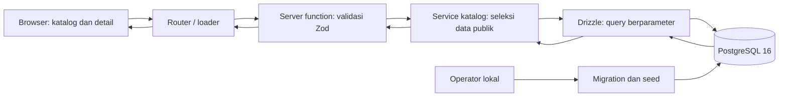
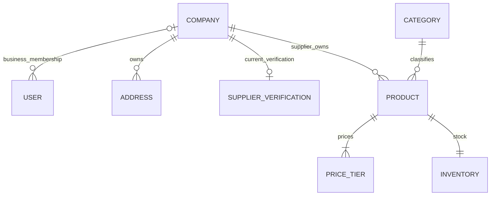
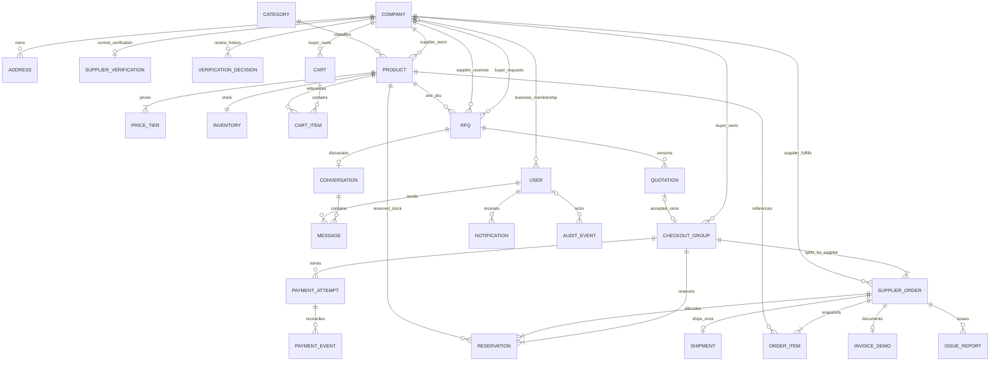

# Fondasi backend persisten Marketplace B2B

Dokumen ini memetakan pekerjaan prioritas pertama: model data, database persisten, seed deterministik, pembacaan katalog melalui backend, dan penyelarasan tampilan terhadap Figma. Cakupan ini merupakan bagian dari produk lengkap; selesainya fondasi tidak berarti seluruh kebutuhan Must atau tiga alur UAT sudah selesai.

## Sumber dan batas cakupan

Kebutuhan diverifikasi dari tiga dokumen Fase 1 versi 0.2 pada 22 September 2026:

- [BRD — tujuan, aktor, kebijakan, dan pengecualian](https://docs.google.com/document/d/1VJt5j8YSoa1g4YLt3ciMLlTazDXPd1m9JNSV8pzLuAU/edit).
- [PRD — PR-01 sampai PR-16, fixture, dan target nonfungsional](https://docs.google.com/document/d/16g_F0CpneOGb9MEMP_aSXqLOjpw96OcP1U8MlLoLUKk/edit).
- [FSD — model konseptual, validasi, transisi, dan skenario penerimaan](https://docs.google.com/document/d/1IPD8PjJ9SPFFiSfnz9BwcuTpIHXHgvcxzM7J1pDP3mg/edit).
- [Figma — halaman 10, Modern / Buyer + Supplier + Admin](https://www.figma.com/design/SbyjMJzXLacghRNc79o6Mk/Marketplace-b2b?node-id=263-4).

Domainnya adalah pengadaan **kemasan** oleh UMKM. Nama perusahaan, alamat, stok, harga, dan pengiriman demo adalah fiktif. Pembayaran riil, escrow, wallet, pembiayaan, perpajakan otomatis, logistik nyata, dan ERP berada di luar baseline.

PRD/FSD menyebut implementasi historis `/demo` yang menggunakan sesi simulasi dan state dalam memori, beserta hasil pengujiannya. Catatan itu bukan bukti kondisi checkout repository ini: baseline yang dilanjutkan di sini berupa scaffold frontend dengan data contoh dan tanpa backend bisnis persisten. Hasil pengujian historis tidak disalin sebagai hasil pengujian pekerjaan ini.

| Area                     | Cakupan fondasi ini                                                                                                                                                     | Kebutuhan yang masih dilanjutkan kemudian                                                                    |
| ------------------------ | ----------------------------------------------------------------------------------------------------------------------------------------------------------------------- | ------------------------------------------------------------------------------------------------------------ |
| Identitas dan perusahaan | Model company, user, role, status aktif, alamat, dan status verifikasi supplier                                                                                         | Login/logout, sesi, registrasi, RBAC, CRUD profil/alamat, serta alur tinjauan Admin                          |
| Katalog                  | Model produk, kategori, tier harga, inventory; seed kemasan; katalog/detail publik melalui backend; pencarian nama/SKU dan kategori; daftar produk dashboard hanya baca | Filter supplier/batas MOQ, urut harga, pagination, CRUD supplier, moderasi, publikasi/arsip melalui akun sah |
| Data persisten           | PostgreSQL, schema/migration Drizzle, seed operator, validasi domain                                                                                                    | Reservasi, snapshot transaksi, konkurensi checkout, migrasi untuk modul berikutnya                           |
| Tampilan                 | Token desain bersama, Light/Dark, katalog/detail responsif dan state baca                                                                                               | Semua layar transaksi serta workspace Buyer/Supplier/Admin dalam Figma                                       |
| Transaksi                | ERD konseptual dan aturan integritas untuk pengembangan berikutnya                                                                                                      | Cart, checkout, pembayaran sandbox, RFQ, quotation, chat, fulfillment, invoice, laporan, notifikasi          |

Belum ada endpoint publik yang menulis data perusahaan atau transaksi. Daftar produk dashboard menggunakan data katalog publik; ini belum merupakan workspace Supplier yang terautentikasi. Menyimpan role dan company ID belum membuktikan otorisasi pengguna; pemeriksaan sesi dan kepemilikan harus hadir sebelum operasi privat dibuka.

PR-03/FS-03 masih terpenuhi sebagian: pencarian nama/SKU dan filter kategori disediakan dalam irisan fondasi, sedangkan filter supplier, batas MOQ, urut harga pada MOQ, dan pagination tetap kebutuhan terbuka untuk kelanjutan katalog. Pembatasan ini tidak mengubah status Must pada dokumen sumber.

## Keputusan stack dan alur baca

Stack fondasi adalah React/TanStack Start yang sudah digunakan repository, Zod untuk validasi input, Drizzle untuk schema/query/migration, dan PostgreSQL 16 sebagai penyimpanan otoritatif. Implementasi dimulai sebagai satu aplikasi modular dengan satu database. Pembagian tanggung jawab berikut bukan permintaan membuat 14 layanan terpisah.

Server functions TanStack Start dipilih untuk komunikasi UI internal. Loader memanggil server function; query database dan konfigurasi koneksi tetap di sisi server. GraphQL client scaffold tidak menjadi sumber data katalog baru. Jika kelak ada integrasi pihak ketiga yang memerlukan HTTP publik, server route dapat menggunakan service yang sama.

Respons publik hanya menyertakan data yang dibutuhkan katalog: identitas produk, supplier publik, spesifikasi, kategori, gambar aplikasi, satuan, MOQ, kelipatan, tier, serta stok tersedia. Email user, alamat privat buyer, data verifikasi, dan informasi koneksi tidak menjadi bagian respons katalog. Produk harus `ACTIVE`, supplier harus `APPROVED`, dan perusahaan harus aktif. Pembatasan yang sama berlaku untuk detail yang diakses melalui URL langsung.

## Peta end-to-end: 14 tanggung jawab

| No. | Area                          | Keputusan untuk fondasi                                              | Batas atau kelanjutan                                                                                |
| --- | ----------------------------- | -------------------------------------------------------------------- | ---------------------------------------------------------------------------------------------------- |
| 1   | Browser dan aksesibilitas     | React; katalog responsif; label, fokus, loading, empty, error, retry | Keyboard, teks 200%, dan ukuran target perlu bukti pengujian aplikasi                                |
| 2   | Design system                 | Semantic tokens yang mengikuti Figma, Inter, tema yang dipertahankan | Jumlah frame Figma bukan jumlah fitur yang selesai                                                   |
| 3   | Routing dan state UI          | TanStack Router/Start; filter katalog dan navigasi detail            | State UI tidak menjadi sumber kebenaran harga/stok                                                   |
| 4   | Transport aplikasi            | Server functions dengan input terstruktur                            | HTTP API eksternal/GraphQL tidak diperlukan untuk irisan ini                                         |
| 5   | Identitas dan otorisasi       | Model user/company/role; pembacaan publik dibatasi                   | Sesi, RBAC, ownership middleware, dan proteksi mutasi merupakan tahap berikutnya                     |
| 6   | Validasi dan kontrak data     | Zod; input server diperiksa; DTO publik eksplisit                    | TypeScript di browser bukan pengganti validasi server                                                |
| 7   | Service dan aturan domain     | Seleksi katalog, harga pada MOQ, tier dan kuantitas valid            | Mesin status pembayaran/pesanan belum diaktifkan                                                     |
| 8   | Akses data                    | Drizzle dan query berparameter di modul server                       | Hindari query database langsung dari komponen/loader universal                                       |
| 9   | Database relasional           | PostgreSQL 16; foreign key, unique/check constraint, transaksi       | Pengujian reservasi bersamaan dilakukan saat checkout dibuat                                         |
| 10  | Evolusi schema dan fixture    | Migration berversi; seed deterministik yang dapat diulang            | Seed/reset hanya operator demo; bukan tombol publik                                                  |
| 11  | Aset dan penyimpanan berkas   | Aset produk demo yang dikelola aplikasi                              | Unggah berkas privat/object storage belum diperlukan                                                 |
| 12  | Integrasi dan pekerjaan latar | Kontrak konseptual pembayaran, event, expiry                         | Simulator pembayaran, worker expiry, dan integrasi provider belum dibangun di fondasi                |
| 13  | Observabilitas dan audit      | Error aman, hasil pemeriksaan lokal terdokumentasi                   | Audit bisnis, metrik, tracing, alert, dan pemantauan produksi belum lengkap                          |
| 14  | Infrastruktur dan operasi     | Aplikasi lokal + cluster PostgreSQL terisolasi di workspace          | Hosting/domain, TLS publik, backup terjadwal, restore drill, dan deployment masih keputusan lanjutan |

Database lokal menggunakan Unix socket di `.local/postgres/socket` dan database `marketplace_demo`. Data berada di disk, sehingga penghentian aplikasi atau PostgreSQL tidak menjadi reset data. Integration/E2E memakai cluster terpisah di `.local/postgres-test`, sehingga restart test tidak mengganggu database demo. Kedua cluster memakai peer authentication dan tidak membuka listener TCP. Detail perintah dan variabel lingkungan mengikuti [README](../README.md) serta `scripts/local-db.mjs`.

Direktori runtime `.local/` tidak masuk version control. Persisten berarti bertahan setelah restart; ini belum merupakan backup, replikasi, atau jaminan ketersediaan produksi.

## Model fondasi

Nama berikut menggambarkan entitas bisnis. Nama tabel/kolom aktual mengikuti schema dan migration yang disertakan repository.

| Entitas              | Data utama                                                                                        | Aturan utama                                                                                                                                     |
| -------------------- | ------------------------------------------------------------------------------------------------- | ------------------------------------------------------------------------------------------------------------------------------------------------ |
| Company              | Jenis Buyer/Supplier, nama, penanggung jawab, deskripsi, status aktif                             | Satu perusahaan memiliki satu jenis bisnis                                                                                                       |
| User                 | Email ternormalisasi, role, company ID untuk role bisnis, status aktif                            | Satu akun memiliki satu role; Buyer/Supplier terikat satu perusahaan yang sesuai; Admin disediakan operator dan tidak memerlukan company bisnis  |
| SupplierVerification | Satu status verifikasi terkini per supplier, referensi dokumen fiktif, reviewer, waktu dan alasan | Kontrak FSD: `PENDING_REVIEW`, `CHANGES_REQUESTED`, `APPROVED`, `SUSPENDED`; riwayat keputusan terpisah perlu ditambahkan bersama workflow Admin |
| Address              | Company, label, penerima, telepon demo, jalan, kota, provinsi, kode pos, default/arsip            | Pemilik eksplisit; alamat arsip tidak dapat digunakan untuk checkout baru                                                                        |
| Category             | Identitas dan nama kategori kemasan                                                               | Produk merujuk kategori yang sah                                                                                                                 |
| Product              | Supplier, SKU, nama, spesifikasi, aset gambar, kategori, unit, MOQ, step, status                  | SKU unik **per supplier**; satuan baseline `pcs`; produk supplier lain tidak boleh diubah melalui company ID dari klien                          |
| PriceTier            | Product, batas bawah kuantitas, harga IDR                                                         | Batas atas diturunkan dari batas bawah tier berikutnya dikurangi satu; mulai dari MOQ; tier terakhir berlaku tanpa batas atas                    |
| Inventory            | Product, `on_hand`, `reserved`                                                                    | Nilai integer nonnegatif; `reserved <= on_hand`; `available = on_hand - reserved`                                                                |

Relasi bisnis dalam ERD tidak otomatis memastikan seluruh aturan lintas tabel. Foreign key gabungan mengikat role/jenis perusahaan serta creator produk/alamat pada perusahaan yang sesuai. Validasi domain dan constraint database bersama-sama harus memeriksa kelengkapan tier, referensi, serta invariant stok. Pengujian harus memeriksa kedua batas itu.

Penyimpanan tier menggunakan batas bawah agar rentang tidak menyimpan dua batas yang dapat bertentangan. Misalnya `100 → 5500` dan `501 → 5000` ditampilkan sebagai 100–500 dan ≥501. `basePriceIdr` merepresentasikan harga pada MOQ, sehingga harus tetap sama dengan harga tier pertama; field tersebut bukan diskon tambahan. Kode status internal dapat memakai huruf kecil, tetapi harus memiliki pemetaan eksplisit ke status FSD dan tidak menghilangkan arti perlu revisi atau penangguhan.

Kamus FSD menetapkan: nama perusahaan 3–120 karakter, penanggung jawab 2–100, deskripsi maksimal 1.000; label alamat 2–40, penerima 2–100, telepon 8–15 digit dengan `+` opsional, jalan 10–250, kota/provinsi wajib, kode pos lima digit. SKU terdiri dari huruf kapital, angka, atau tanda hubung sepanjang 1–64 karakter; nama produk 5–140; spesifikasi maksimal 4.000. MOQ dan step berupa integer positif dan MOQ habis dibagi step. Harga minimal Rp1 dan disimpan dalam rupiah bulat. Penerapan batas-batas ini harus diperiksa terhadap schema dan validator, tidak disimpulkan hanya dari tipe field.

## ERD konseptual produk lengkap

Entitas transaksi pada diagram ini merupakan **rancangan tahap berikutnya**, bukan klaim tabel/API transaksi sudah tersedia. Diagram menghubungkan fondasi sekarang ke seluruh domain PRD/FSD, agar penambahan checkout atau RFQ tidak memerlukan penggantian model kepemilikan.

`CheckoutGroup` menyimpan alamat snapshot dan total yang disetujui. `SupplierOrder` menyimpan pihak, status pemenuhan, dan biaya snapshot. `OrderItem` menyimpan nama/SKU/satuan/spesifikasi ringkas, kuantitas, harga, dan subtotal snapshot; referensi produk tidak menjadi sumber harga historis. `InvoiceDemo` membaca snapshot sub-order. `AuditEvent` dan `Notification` membawa jenis/ID objek terkait; garis ke setiap kemungkinan objek sengaja tidak digandakan dalam diagram.

Invariant untuk tahap transaksi:

1. **Cart dan RFQ tidak mencadangkan stok.** Commit checkout memeriksa semua item dan membuat induk, sub-order, snapshot, serta reservation secara atomik. Kegagalan satu item membatalkan seluruh commit. Satu checkout menggunakan satu alamat.
2. **Harga all-units per SKU.** Kuantitas SKU yang sama menentukan satu harga untuk seluruh unit dalam sub-order; tidak menggabungkan SKU atau supplier. Review mempunyai fingerprint harga, kuantitas, biaya, dan alamat; perubahan meminta persetujuan ulang.
3. **Reservasi memiliki siklus sendiri.** Checkout menaikkan `reserved`; pembayaran sukses tidak mengurangi stok. Pengiriman mengurangi `on_hand` dan `reserved` tepat sekali. Checkout batal/expired sebelum dibayar melepaskan reservation tepat sekali.
4. **Pembayaran bukan status browser.** Event harus diautentikasi, dideduplikasi, dan dicocokkan referensi/nominal/IDR/status. Redirect sukses tidak membuat checkout lunas. Event terlambat atau nominal salah masuk review dan tidak membuka fulfillment.
5. **Retry memiliki batas.** Hanya attempt `FAILED` terkonfirmasi yang dapat dicoba ulang saat checkout masih `AWAITING_PAYMENT` dan sebelum tenggat 24 jam. Referensi attempt baru memakai total snapshot yang sama, maksimal satu instruksi aktif, tanpa memperpanjang tenggat. `PENDING`, timeout, dan `REVIEW` tidak membuat attempt baru otomatis.
6. **Quotation berversi dan dipakai sekali.** Hanya versi `SENT` terbaru yang masih berlaku dapat diterima. Penerimaan, pembuatan checkout, reservation, dan perubahan RFQ menjadi `AWARDED` terjadi dalam satu transaksi. Checkout quotation terpisah dari cart. Chat tidak mengubah harga formal.
7. **Fulfillment per supplier.** Satu shipment penuh per sub-order; pengiriman memerlukan pembayaran sah. Buyer mengonfirmasi penerimaan secara eksplisit. Satu supplier selesai tidak menyelesaikan seluruh checkout, dan tidak ada auto-complete berdasarkan waktu.
8. **Laporan membatasi objek terkait.** Laporan `OPEN`/`IN_REVIEW` memblokir pengiriman/penerimaan sub-order terkait. Resolusi Admin tidak membuat barang diterima atau mengembalikan uang otomatis. Supplier yang ditangguhkan tetap menangani kewajiban pesanan lama.
9. **Akses tetap mengikuti perusahaan.** Server menentukan company dari sesi sah, bukan request. Admin tidak boleh memaksa lunas atau mengubah snapshot; akses percakapan untuk penanganan kasus perlu alasan dan audit.
10. **Idempotensi meliputi efek samping.** Kunci checkout berulang dengan payload sama mengembalikan hasil yang sama; payload berbeda adalah konflik. Pesan deduplikasi per pengirim/client message ID; notifikasi per event/penerima. Konkurensi harus diuji terhadap stok bersama antarsesi.

## Fixture kanonis

| Field                       | Supplier A                        | Supplier B                |
| --------------------------- | --------------------------------- | ------------------------- |
| Perusahaan fiktif           | PT Sumber Kemasan Jaya            | PT Kemasan Nusantara      |
| Nama produk                 | Kardus Packing Ukuran 30×20×15 cm | Kardus Kirim Ukuran Besar |
| SKU                         | `KRD302015`                       | `KRDBESAR`                |
| Satuan                      | pcs                               | pcs                       |
| MOQ / step                  | 100 / 1                           | 50 / 1                    |
| `on_hand` / `reserved` awal | 5.000 / 0                         | 2.000 / 0                 |
| Harga per unit              | 100–500: Rp5.500; ≥501: Rp5.000   | ≥50: Rp8.000              |

Seed menyediakan dua perusahaan Buyer terpisah, dua perusahaan Supplier terpisah, dan satu Admin. Nama Buyer tidak ditetapkan dalam sumber; nama/email/alamat yang dipilih implementasi adalah fixture fiktif. Identitas seed belum berarti akun tersebut dapat login. Seed berulang harus menjaga identitas deterministik tanpa menggandakan perusahaan, user, produk, tier, atau inventory. Pengembalian data fixture dilakukan melalui operator demo, bukan endpoint anonim.

Contoh batas harga yang wajib dipertahankan: 500 unit A menghasilkan subtotal Rp2.750.000; 501 unit A menghasilkan Rp2.505.000. Penurunan total ini disengaja oleh fixture **all-units**, sehingga detail produk perlu menjelaskan bahwa harga berlaku untuk seluruh unit.

Fixture transaksi untuk tahap berikutnya: ongkir A Rp25.000 dan B Rp20.000 per sub-order; 100 A + 50 B menghasilkan Rp995.000; 200 A + 50 B menghasilkan Rp1.545.000. Quotation 1.000 A menghasilkan Rp5.000.000 + Rp50.000 = Rp5.050.000. Pajak, komisi, dan diskon tambahan bernilai nol. Angka tersebut bukan tarif logistik atau penawaran komersial.

## Penyelarasan design system

PRD bagian 9 menetapkan dasar visual berikut; sampel frame Figma tetap menjadi acuan tata letak layar yang sedang dibuat.

| Token         | Light     | Dark      |
| ------------- | --------- | --------- |
| Primary       | `#2563EB` | `#3B82F6` |
| Secondary     | `#F59E0B` | `#FBBF24` |
| Canvas        | `#F8FAFC` | `#0F172A` |
| Surface       | `#FFFFFF` | `#1E293B` |
| Teks utama    | `#0F172A` | `#F8FAFC` |
| Teks sekunder | `#64748B` | `#94A3B8` |
| Border        | `#E2E8F0` | `#334155` |

Tipografi memakai Inter: H1 24 px bold, H2 18 px semibold, body 14 px dengan line-height 1,5, label 12 px, harga 16 px bold. Margin mobile 20 px, ritme ruang 8/16/24/32 px, radius kontrol 12 px dan kartu 16 px. Kontrol utama mempunyai target sentuh minimal 48 px. Variasi semantik warna digunakan bila diperlukan agar teks dan badge tetap terbaca.

Tema dipertahankan setelah navigasi/reload. Status memakai teks/ikon selain warna. Katalog membedakan belum ada produk, pencarian tanpa hasil, dan kegagalan layanan; pencarian kosong menyediakan hapus filter. Detail menunjukkan harga pada MOQ, seluruh rentang tier, MOQ/step, unit, stok tersedia, supplier, dan label aset demo bila gambar berupa ilustrasi.

Keranjang, RFQ, pembayaran, dan akun yang belum tersedia tidak boleh diberi tombol aktif yang berpura-pura menyelesaikan transaksi. Penyelarasan fondasi berfokus pada katalog/detail dan komponen bersama; tidak menyatakan seluruh 326 frame referensi sudah diimplementasikan.

## Penerimaan fondasi dan bukti

Status berikut mencatat hasil lokal pada 24 September 2026. Detail perintah dan jumlah test tersedia di `DEVELOPMENT_SCOPE.md`.

| Pemeriksaan                      | Hasil yang diharapkan                                                                                     | Status lokal                                                    |
| -------------------------------- | --------------------------------------------------------------------------------------------------------- | --------------------------------------------------------------- |
| Migration database kosong/legacy | Seluruh tabel/constraint terbentuk; status lama dipetakan dan data tidak kompatibel ditolak               | Lulus melalui integration test                                  |
| Seed dua kali                    | Jumlah dan identitas fixture tetap; perubahan sah tidak direset                                           | Lulus melalui integration test                                  |
| Invalid input                    | Pecahan/negatif, SKU salah, MOQ/step tidak valid, tier invalid, dan overflow ditolak                      | Lulus melalui unit/integration test                             |
| Integritas relasi                | Owner/role/jenis perusahaan dan referensi produk sesuai kontrak; reserved tidak melebihi on_hand          | Lulus melalui negative integration test                         |
| Katalog dan detail               | Hanya produk ACTIVE dari supplier APPROVED/aktif dengan tier/inventory sah; filter digabungkan dengan AND | Lulus melalui integration/E2E                                   |
| Batas data publik                | Respons tidak membocorkan email user, alamat Buyer, atau dokumen verifikasi                               | Lulus melalui assertion DTO publik                              |
| Persistensi                      | Pembacaan konsisten setelah proses/koneksi baru dan restart PostgreSQL                                    | Lulus melalui integration test restart                          |
| Integrasi UI                     | SSR, navigasi client, reload, detail/404, empty/error/retry memakai backend yang sama                     | Lulus 12 E2E Chromium                                           |
| Desain dan aksesibilitas         | Light/Dark, viewport, fokus, target 48 px, kontras dasar, dan teks 200% diperiksa                         | Otomatis lulus; review manual Figma dikecualikan dari tahap ini |
| Build dan kualitas kode          | Frozen install, typecheck, lint, format, build, serta test relevan lulus                                  | Lulus lokal; CI/deployment belum diklaim                        |

Target PRD p95 baca katalog/detail ≤2 detik pada 1.000 produk dan 20 pengguna bersamaan belum dianggap terukur melalui smoke test. Pengujian UAT-A/B/C lengkap, transaksi konkuren, dan autentikasi antarperusahaan menunggu implementasi modul terkait. Deployment, audit aksesibilitas penuh, dan kesiapan produksi juga bukan hasil dari dokumen arsitektur ini.
